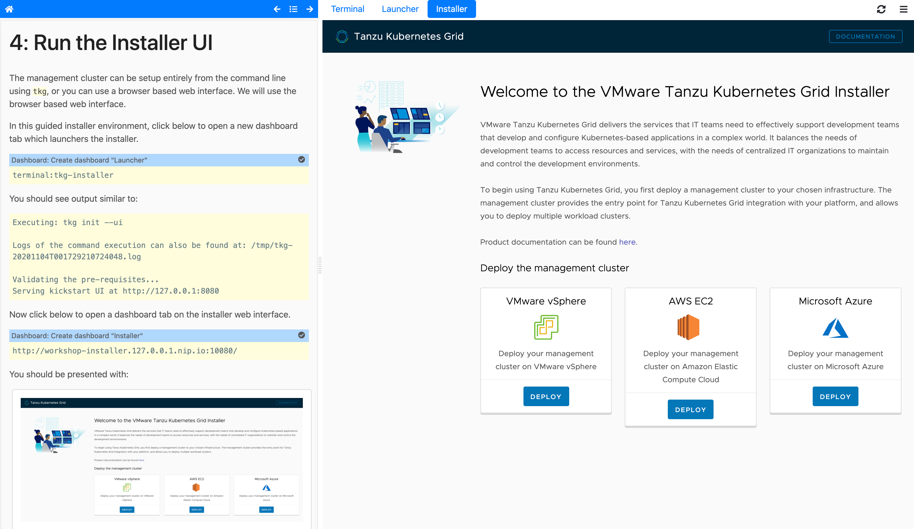

Guided installer for TKG on AWS
===============================

This is a guided installer for deploying a Tanzu Kubernetes Grid (TKG)
management cluster to Amazon Web Services (AWS). The installer also provides
some examples for creating additional workload clusters and managing them.



The installer is intended to be run on your local docker service using
``docker-compose``. You will then be provided with a web interface which
steps you through the installation.

The installer mounts the docker service socket from your local machine and
during an install will temporarily deploy a ``kind`` Kubernetes cluster to
your local docker service. For this to work, if you are using Docker Desktop
on macOS or Windows (WSL 2), your local docker service must be configured with
at least 6 GB of memory and that amount of memory should be available for use.
If running on Linux, your host needs to have that amount of memory available.

To run the installer execute the command:

```
./run-installer.sh
```

in the current directory.

If the installer hasn't been run previously, this will first build the
installer image. Once the build has completed and the container started,
the installer web interface can then be accessed at the URL:

* http://workshop.127.0.0.1.nip.io:10080

To stop the installer, use ``ctrl-c``.

To clean up the stopped container when finished with the installer, run:

```
docker rm lab-tkg-aws-installer
```

The installer also creates four docker volumes. These are used for holding
the downloaded installer binaries, as well as the ``tkg`` and ``kubectl``
configuration. They exist such that if the container is stopped and you run
it again, you still have the configuration and ``tkg`` binary which allows
you to still talk to the management cluster.

To remove these volumes run:

```
docker volume rm lab-tkg-aws-installer_bin
docker volume rm lab-tkg-aws-installer_kube
docker volume rm lab-tkg-aws-installer_kube-tkg
docker volume rm lab-tkg-aws-installer_tkg
```

You should only delete these after you have deleted any workload and
management cluster, or copied the required configuration for ``tkg`` to
talk to the clusters.
