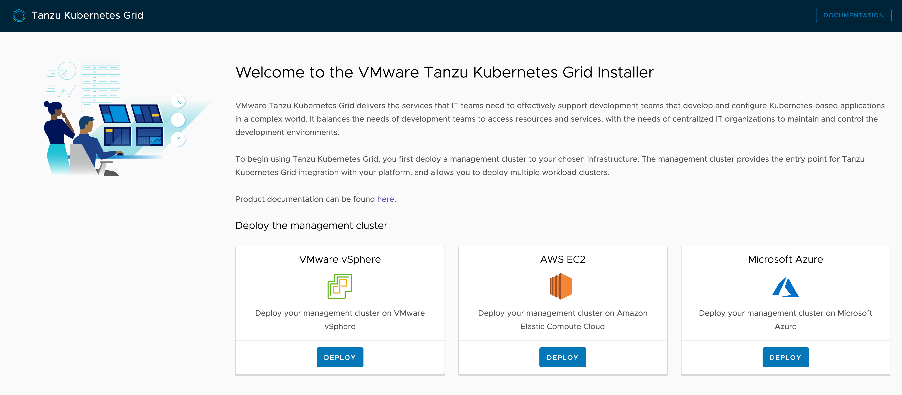

The management cluster can be setup entirely from the command line, or you can use a browser based web interface. We will use the browser based web interface.

To start up the web interface run:

```execute-3
tkg init --ui --bind workshop-installer.127.0.0.1.nip.io:8080 --browser=none
```

If you were running this on your own machine, you would use only ``tkg init --ui``. The ``--bind`` and ``--browser`` options are required in this case because of how the installer environment works.

In this installer environment to open the web interface click on the **Installer** tab.

```dashboard:open-dashboard
name: Installer
```

You should be presented with:



The browser based web interface provides three choices as to where the management cluster can be installed. These are:

* VMware vSphere
* AWS EC2
* Microsoft Azure

For this guided installer we will be using the AWS EC2 option.
