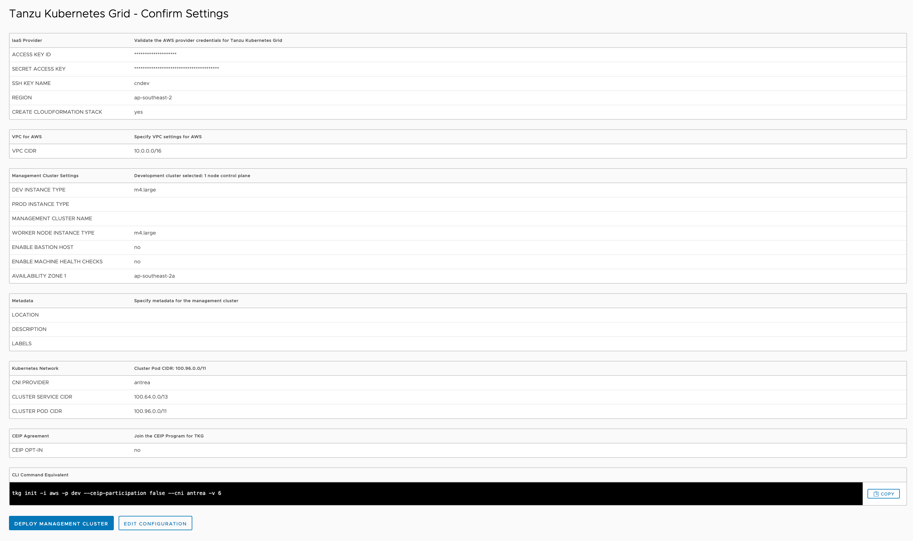

To review the configuration details you have provided now click on **REVIEW CONFIGURATION**.

If you have made any mistakes you can go back and edit the configuration by clicking on **EDIT CONFIGURATION**.

If everything looks okay, you are ready to start the process of deploying the management cluster.
