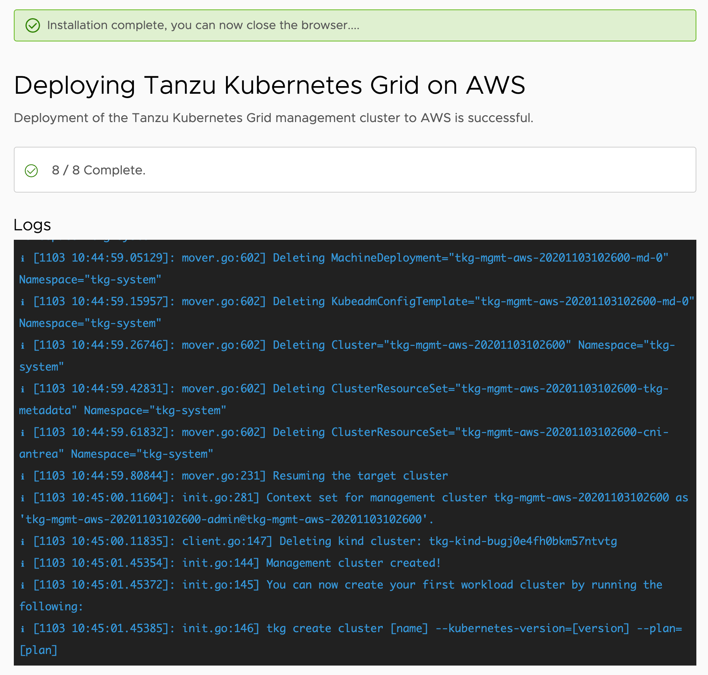

To start the deployment of the management cluster click on the **DEPLOY MANAGEMENT CLUSTER** button.

This will bring up a view of the log messages as the installer runs the steps to create the management cluster.

The overall process can take up to 15 minutes. The exact time it takes will depend on whether the required container images are cached locally, as well as the speed of network connections between where you are running the installer and the AWS region you are using.

As the deployment progresses we will explore what is occuring.
