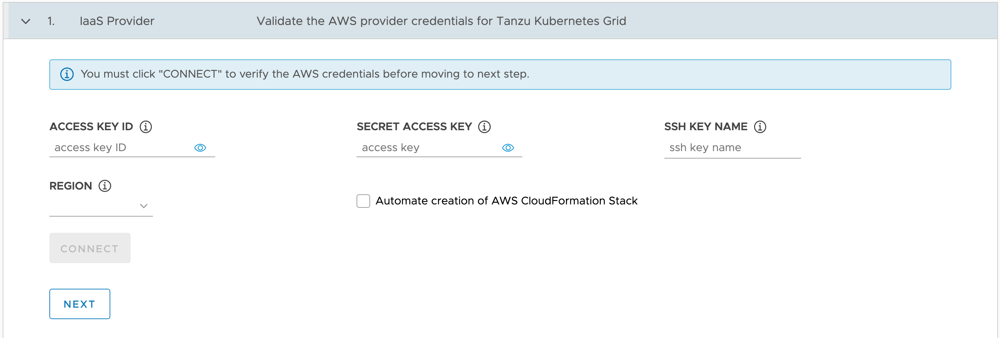

Click on the **Deploy** button for the AWS EC2 option.

This should initially bring up the form for entering you credentials for the IaaS Provider, in this case those for AWS.



In this form enter your AWS credentials in the **ACCESS KEY ID** and **SECRET ACCESS_KEY** fields.

In the **REGION** field select the AWS region where you want to deploy the TKG management cluster.

For the **SSH KEY NAME** field, enter the name of an SSH Key Pair registered in EC2 against the AWS region you specified. The SSH key will be added to each node in the Kubernetes cluster to allow remote shell access. We will not be accessing the node in this way, so it doesn't matter if you do not know the private part of the SSH key pair.

If this is the first time you have used the TKG installer with this AWS account, you must enable the **Automate creation of AWS CloudFormation Stack** option. This CloudFormation stack provides the identity and access management (IAM) resources that TKG needs to create management clusters and Tanzu Kubernetes clusters in Amazon EC2. The IAM resources are added to the control plane and node roles when they are created during cluster deployment.

Once details have been entered, click on **CONNECT** to verify that they are correct. If successful, the **CONNECT** button will be grayed out and replaced with **CONNECTED**.

If the supplied credentials are incorrect, cannot be used, or some other problem occurs, you will be presented with an error. In the case of the credentials being incorrect or not having the required Adminstrator access you will see the error message:

```
Invalid AWS credentials: all credentials and region must be valid. AuthFailure: AWS was not able to validate the provided access credentials status code: 401, request id: ...
```

If the entered details validate, click on **NEXT** in the form.
