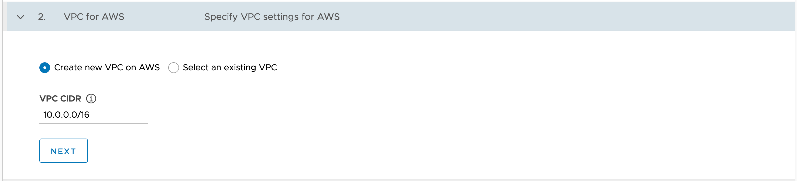

The next form that should now be presented is that for specifying the Virtual Private Cloud (VPC) settings for AWS. This is used to select an IP address range that will be used when generating IP addresses for hosts created as part of the Kubernetes cluster, as well as pods and services within the Kubernetes cluster.

If you are testing out TKG the default option of **Create new VPC on AWS** and the CIDR block of ``10.0.0.0/16`` should be suitable. You would only need to customize this for more advanced deployments where you know you will need to bridge the networks of multiple VPC instances. This is because when bridging the networks of multiple VPC instances the respective VPC instances can't use overlapping CIDR blocks.

Leave this setting as the default value of ``10.0.0.0/16``.

Click on **NEXT** in the form.
