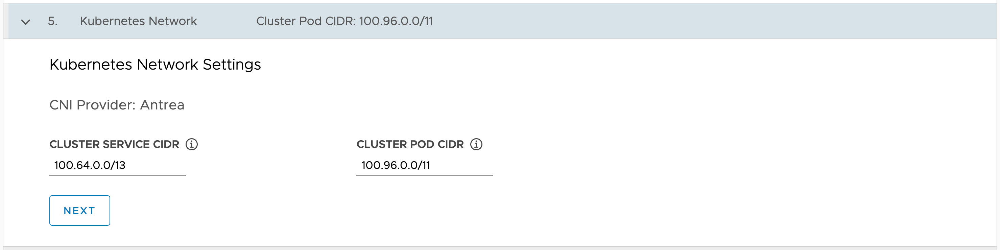

We are almost done with configuration of the Kubernetes management cluster. In this next form you need to specify the CIDR block allocations for the service and pod networks within the Kubernetes clusters.

What these allocations determine is the range of IP addresses which will be used for pods created in the Kubernetes cluster, and the separate range of IP addresses which will be used for services. These two CIDR blocks cannot overlap.

Since we used the default CIDR block for the VPC, you can leave these as the defaults.

Click on **NEXT** in the form.
