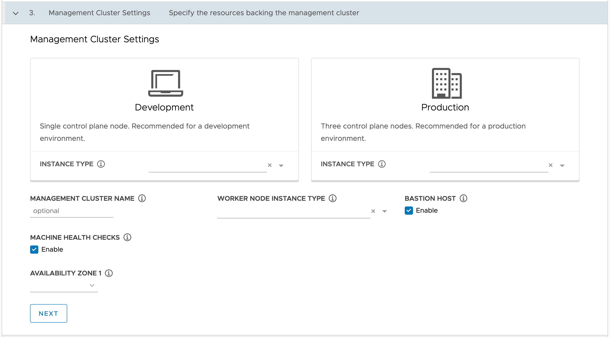

The next form to be filled in is where you need to provide details about the Kubernetes management cluster to be created. This includes the intended purpose of the Kubernetes cluster (development vs production), the cluster name, the EC2 instance types to be used for the control plane and worker nodes, the AWS availability zone etc.

If the Kubernetes management cluster is only going to be used for testing or management of disposable development workload clusters, you would likely choose the **Development** cluster type. For this type of cluster, only a single control plane node will be created.

The **Production** cluster type in comparison results in three control plane nodes being created, providing a level of redundancy in the event that one of the control plane nodes fails.

For this guided installer, choose the **Development** cluster type.

For the type of cluster selected you next need to select the EC2 instance type to be used for the control plane nodes. This provides a very long list of choices. Which exact instance type you select will depend on the number of worker nodes and how the cluster is used.

Some guidelines for selection of the instance type can be found in the Kubernetes documentation at:

* https://kubernetes.io/docs/setup/best-practices/cluster-large/#size-of-master-and-master-components

For AWS, it specifies sizing for the master node based on the number of worker nodes as follows:

* 1-5 worker nodes: m3.medium
* 6-10 worker nodes: m3.large
* 11-100 worker nodes: m3.xlarge
* 101-250 worker nodes: m3.2xlarge
* 251-500 worker nodes: c4.4xlarge
* more than 500 worker nodes: c4.8xlarge

In this case we are only deploying a Kubernetes management cluster and so under normal circumstances would not be deploying actual application workloads to this cluster, but would later create a separate workload cluster for that purpose. As such, you can use the smallest recommended EC2 instance type.

Note that the "m3" instance types are old and are not available in all regions so you may need to do your homework to determine what is the next best option in the region you want to use. For 1-5 worker nodes, if "m3.medium" is not available, an alternative would be "m4.large".

Having selected the EC2 instance type for the control plane nodes, give a name to your Kubernetes management cluster, or leave it blank if you want a name to be generated for you. If you do specify a name, that name must be compliant with DNS hostname requirements.

You have already selected an EC2 instance type for the control plane nodes, but you now need to also select the EC2 instance type for the worker nodes. These nodes have different requirements to the control plane nodes and what you use will depend on the type of application workloads you deploy.

Controlling factors which will determine what EC2 instance type should be used for the worker nodes are the amount of memory required, CPU performance, and maximum number of storage volumes permitted per node.

Since this is for the Kubernetes management cluster and we will be creating a separate workload cluster into which to deploy applications, only a single worker node will be created adequate for running the cluster management API services. An adequate EC2 instance type for this is "m4.large".
