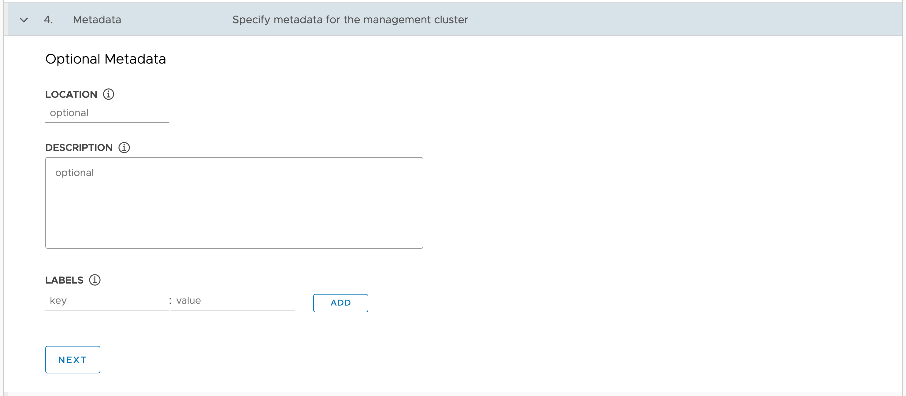

The next form provides you with the option to assign metadata to the cluster being created. You can query this metadata later to discover the purpose of a cluster.

You can leave these details blank, so click on **NEXT** in the form and continue.
