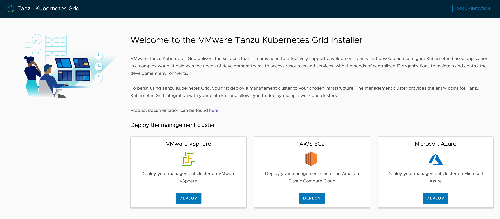

The initial TKG management cluster can be setup entirely from the command line, or you can use a browser based web interface. We will use the browser based web interface.

To start up the web interface run:

```execute-3
tkg init --ui --browser=none
```

If you were running this command on your own machine you would leave out the ``--browser=none`` option. Leaving out that option would result in your web browser being open automatically on the TKG installer web interface.

In this installer environment to open the web interface click on the **Installer** tab.

```dashboard:open-dashboard
name: Installer
```

You should be presented with:



The browser based web interface provides three choices as to where a TKG cluster can be installed. These are:

* VMware vSphere
* AWS EC2
* Microsoft Azure

For these instructions we will be using the AWS EC2 option.
